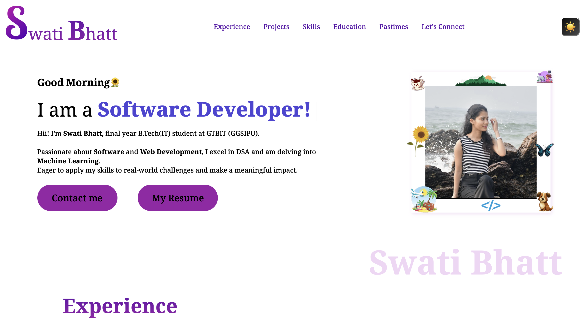
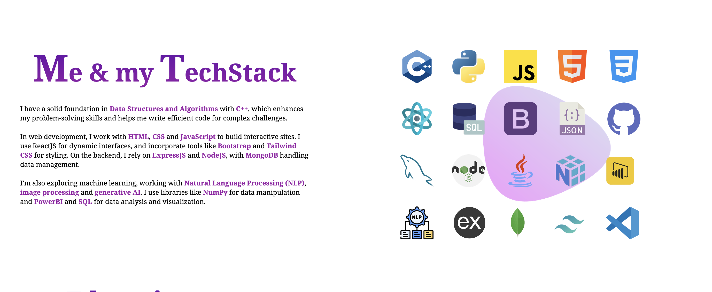

# Hii, I'm Swati Bhatt👩🏻‍💻!

# My Portfolio Website🌻  

My portfolio website highlights my skills, projects, and experiences in a simple, organized layout. 

A space to explore what I do, my background, and how I approach my work, all in just one convenient place.

[Visit Now🚀](https://swati-bhatt.github.io/Portfolio/)

##  ☞Tech Stack Used 🖇️

##  ☞Features🧐
- Light/dark mode toggle🌗
- Cross platform 🫨
- Clean and Simple Layout🗂️
- Contact Form for Easy direct communication📡
- Interactive Animations🦋
- Includes Intro, education, work experience, tech-stack, projects, hobbies, contact-form and footer with social profile links...🔍

##  ☞Sneak Peak 🫣

##  ☞Feedback✍🏻
I’d love to hear your thoughts on this project and would really appreciate any suggestions you have. Please feel free to reach out to me at:
get.swatibhatt@gmail.com

##  ☞Contact Me 📩
 

